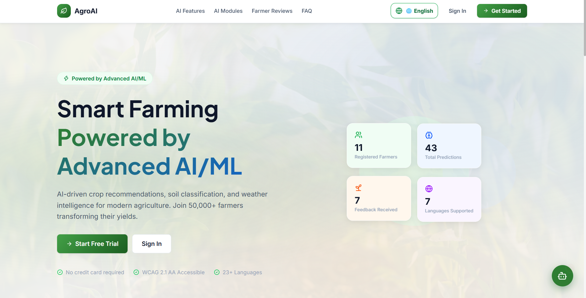
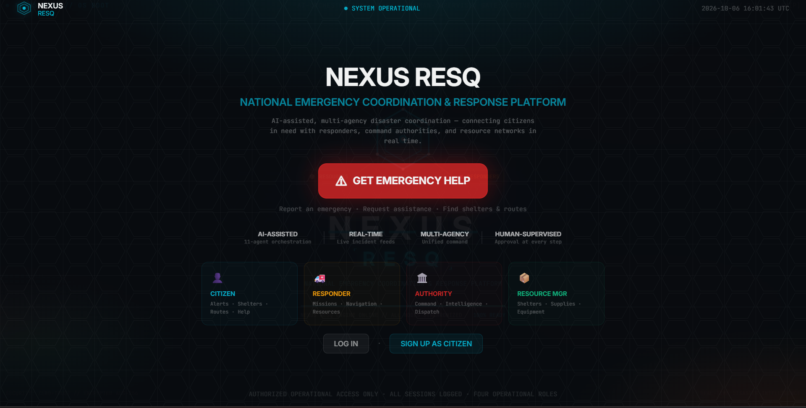
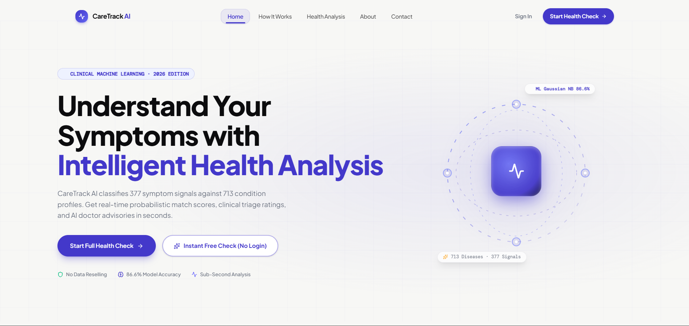

 

 
 

## 👋 Hi, I'm Neeraj Grover

### AI/ML • Full-Stack Development • Software Development

  I build practical software and AI-powered applications by turning ideas into real, usable products.
   
  Currently focused on strengthening my skills in <b>AI/ML, backend development, APIs, databases, and modern web technologies.</b>

&nbsp;

 

## 👋 About Me

I'm Neeraj Grover, a B.Tech student who enjoys learning by building and experimenting with new ideas. I like working on practical projects, solving problems, and collaborating with people who are equally curious about technology.

> **"I learn best when I build something real."**

 

<table>
<tr>
<td width="50%" valign="top">

### 🔭 Currently Working On

Building practical projects and improving my skills through hands-on experience.

</td>

<td width="50%" valign="top">

### 🌱 Currently Learning

AI/ML, software development, and better ways to build reliable applications.

</td>
</tr>

<tr>
<td width="50%" valign="top">

### 🤝 Looking to Collaborate

Interesting projects where people can share ideas, learn together, and build something useful.

</td>

<td width="50%" valign="top">

### 💬 Ask Me About

Projects, hackathons, AI/ML, web development, and learning through hands-on work.

</td>
</tr>
</table>
 

## 🛠️ Tech Stack

### 💻 Languages

  

### 🌐 Frontend

  

### ⚙️ Backend & APIs

  

### 🧠 AI / Machine Learning

  

### 🗄️ Databases

  

### 🔧 Tools & Design

  

 

## 🚀 Featured Projects

<table>
<tr>

<td width="50%" valign="top">

<h3>🌱 AgroAI</h3>

AI-powered soil health assessment and crop recommendation platform.

<strong>Tech:</strong> React • TypeScript • FastAPI • PostgreSQL • TensorFlow

</td>

<td width="50%" valign="top">

<h3>🚨 Nexus ResQ</h3>

AI-assisted disaster coordination platform designed to support emergency response and resource management.

<strong>Tech:</strong> React • TypeScript • FastAPI • PostgreSQL • AI

</td>

</tr>

<tr>

<td width="50%" valign="top">

<h3>🩺 CareTrack</h3>

Smart symptom analysis platform focused on helping users understand symptoms through an interactive interface.

<strong>Tech:</strong> React • TypeScript • FastAPI • AI

</td>

<td width="50%" valign="top">

<h3>🏆 ResQ Pilot</h3>

AI-powered disaster coordination project developed during a 24-hour hackathon.

<strong>Achievement:</strong> Top 7 among 145 teams

<strong>Focus:</strong> Emergency coordination • AI agents • Resource management

</td>

</tr>
</table>
 

## 🏆 Achievements

<table>
<tr>
<td width="50%" align="center">

### 🥇 AIR 4
**Social Science Quiz**

</td>

<td width="50%" align="center">

### 🚀 Top 7
**Cypherverse 24-Hour Hackathon**

145 teams participated

</td>
</tr>
</table>

 

## 📊 GitHub Analytics

  

 

